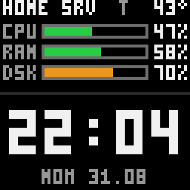
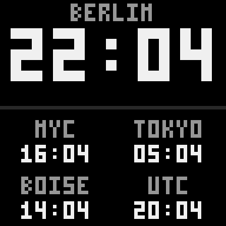
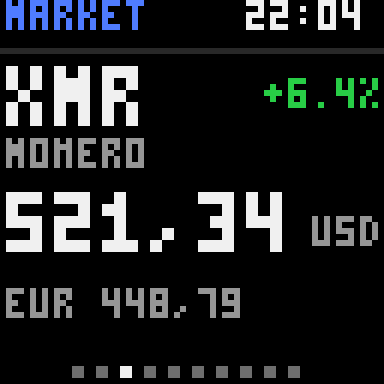
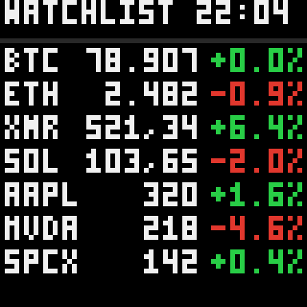
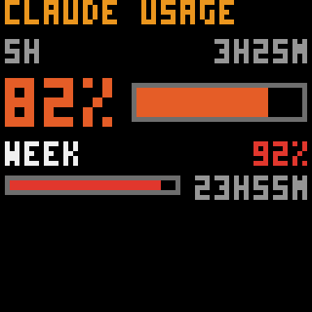
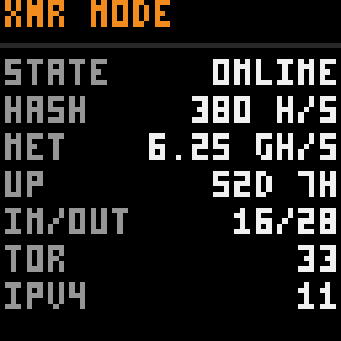

# Pixoo‑Local — How it works

A fully **local, cloud‑free** control platform for the Divoom **Pixoo 64**. The
device boots and runs with **no internet at all**: a small server on your LAN
impersonates Divoom's bootstrap + MQTT infrastructure, and a browser GUI lets you
build the screens (clock, world clocks, crypto, stocks, a Monero node, Claude
usage, …). Screen on/off runs on a weekday timer and through Apple Home / Alexa /
Google / Homebridge.

> All IPs, device IDs and MACs in this repo are **placeholders/examples**. Fill in
> your own (see [INSTALL.md](../INSTALL.md)). No tokens or passwords are stored in
> the repo — they live only in `/etc/pixoo-local/` (chmod 600) on your host.

---

## 1. The core idea — replacing the connection to Divoom's cloud

Out of the box a Pixoo 64 talks to Divoom's servers in China
(`app.divoom-gz.com`, plus a dynamic MQTT broker). Every clock face, every push
and even *staying connected* depends on that cloud. We keep the Pixoo **WAN‑blocked**
(a firewall rule on the router denies the Pixoo's MAC any route to the internet)
and stand up a **look‑alike** of the pieces the firmware needs, on a dedicated LAN
IP. The firmware never notices the difference.

Three things had to be emulated, discovered by observing/answering the real
server for this exact device:

### 1.1 DNS redirect
The Pixoo resolves `app.divoom-gz.com` through the DNS server it is handed by
DHCP. We add **one A record** there:

```
app.divoom-gz.com   A   <advertise_ip>      # the pixoo-local server, e.g. 10.0.0.60
```

No wildcard, no AAAA. Now every bootstrap request the firmware makes lands on our
server instead of China. (We never change the router, DHCP or DNS automatically —
INSTALL.md tells you the exact record to add.)

### 1.2 HTTP bootstrap — `Device/InitV2`
On boot (and periodically) the firmware POSTs to `http://app.divoom-gz.com/Device/InitV2`
with its MAC. The real server replies with the device's identity and where to find
MQTT. If **any** field is wrong the firmware rejects it and re‑runs InitV2 in a
tight loop (the "connecting" spinner). Our `bootstrap/` server
([bootstrap/core.py](../bootstrap/core.py), [bootstrap/app.py](../bootstrap/app.py))
returns the **full, exact** reply for this device:

* the real assigned `DeviceId` and bound `UserId` (read once from the real server
  with [scripts/discover_device.sh](../scripts/discover_device.sh) — never guessed),
* the MQTT server = our `advertise_ip`, a JWT `DeviceToken`
  ([common/tokens.py](../common/tokens.py)), `LocalToken`, timezone, `SummerZone`,
  `ScreenOnOff`, `Offline/OnlineTime`, `CustomType`, …
* a **public‑looking** `DevicePublicIP` and a `GET /Test/GetIP` reply
  (`CustonIP` — Divoom's field‑name typo, kept as‑is). Returning the device's
  *private* LAN IP here also triggers the re‑init loop, so the bootstrap fetches
  the **container's own WAN IP** and keeps it current across nightly ISP re‑connects
  (read‑only; the Pixoo itself never goes to the internet).

The server only answers for the `app.divoom-gz.com` Host header — any other host
gets a 404 and no credentials.

### 1.3 MQTT — the "stay connected" handshake
After InitV2 the firmware opens an MQTT session to our broker (a dedicated
Mosquitto in the container). Two things keep it happy
([mqtt/heartbeat.py](../mqtt/heartbeat.py), [mqtt/protocol.py](../mqtt/protocol.py)):

* We publish a **retained** server heartbeat to the global topic
  `divoom/2/DeviceHeart` on connect and every few seconds. The firmware keeps its
  local HTTP API (port 80) open only while it keeps receiving this.
* We answer the device's connect/sync batch on `.../get`: the `Device/Connect`
  reply carrying the numeric `LocalToken`, the full `Sys/GetConf`, and — on a
  **fresh cold boot** — a handful of extra `Get…List` commands (fonts, faces,
  alarms, time plans). Missing any one of them keeps a fresh boot looping. A
  generic fallback answers any unknown `Get<Name>List` with an empty `<Name>List`
  (the data is cached on the device), and templates captured from the real server
  live in [config/mqtt_responses.json](../config/mqtt_responses.json).

### 1.4 The crypto/mining face crash — the "safe clock"
The Pixoo loads its **stored** clock face on boot *before* it connects. If that
face is a **cloud** face (e.g. the crypto/mining face) it hangs on its loading
spinner with no internet and drags the device back into the connect loop — no
server‑side config can win that race. Fix: on connect the supervisor switches the
device onto a verified **local** face (`display.safe_clock_id`) with
`Channel/SetClockSelectId`, then pushes our own frames over it. See
[controller/supervisor.py](../controller/supervisor.py).

**Result:** power on with no internet → local face (no hang) → InitV2 + MQTT
complete against our server → the device goes idle **stable** → we push the
dashboard over HTTP. Reconnect after a power cut is automatic and fast (the
supervisor polls every 1 s for a few minutes after any drop, which also keeps the
macvlan ARP warm).

---

## 2. Architecture & network isolation

Everything runs in **one Docker macvlan container** on a dedicated LAN IP
(`advertise_ip`), so it has its own MAC/IP and can bind `:80` (bootstrap) and
`:1883` (MQTT) without colliding with anything already on the host (Pi‑hole,
a shared Mosquitto, Home Assistant, Homebridge…). The host is never modified.

```
 Pixoo 64 (WAN‑blocked)          Docker macvlan container = pixoo-local
 ───────────────────────         ─────────────────────────────────────
  DNS: app.divoom-gz.com  ──►  :80   bootstrap  (Device/InitV2, /Test/GetIP)
  MQTT ───────────────────►  :1883 mosquitto  + heartbeat responder
  local HTTP API  ◄────────  supervisor  (safe clock, brightness, frame push)
                             :8090 control UI   ·   :8091 screen editor
```

**macvlan quirk & the data bridge.** A macvlan container cannot talk to its *own*
host. So host‑local APIs (the Monero node, custom data) can't be read from inside
the container. A tiny **host** service, the *data bridge*
([scripts/data_bridge.py](../scripts/data_bridge.py)), fetches everything on the
host and writes plain JSON to `data/<name>.json`, which **is** readable inside the
container (bind‑mounted). Widgets read those files. This is also why the Pixoo can
stay fully WAN‑isolated: **only the host** ever reaches the internet, never the
device.

---

## 3. The screens & widgets

A *screen* is a background + a list of *widgets*, each drawn into an `x,y,w,h` box
of the 64×64 frame. Screens rotate as a playlist; a screen with a cycling widget
(e.g. a market card) is held until all its slides have shown, then the next screen
comes up. Layout lives in [config/screens.json](../config/screens.json) and is
edited in the browser — no code needed. Widget code:
[dashboard/widgets.py](../dashboard/widgets.py).

| widget | shows |
|---|---|
| `text`, `line`, `rect` | labels / dividers / blocks |
| `clock` | time in any timezone (auto DST); no tz = the configured home zone |
| `date` | date, several formats |
| `sysbars`, `metric` | CPU / RAM / disk / temperature |
| `market` | crypto + stocks in EUR/USD/%, as cycling cards or a paginated list |
| `claude` | Claude usage limits (5h / weekly) with % + reset countdown |
| `kv` | label/value pairs from any JSON file or URL (the Monero node, custom sources) |
| `bar` | a 0–100 % bar (usage, a value, cpu/ram/disk, or a JSON field) |

The **font** is a self‑contained 3×5 pixel font (no third‑party font); it is
uppercase‑ASCII, which is why some values are formatted specially (e.g. stock
tickers keep their whole symbol, dropping the dot before ever truncating).

### The default screens (screenshots)

| | |
|---|---|
| **Home Server** — stats + clock + date |  |
| **Clocks** — Berlin big + world clocks |  |
| **Market** — cycling card, EUR/USD/% |  |
| **Watchlist** — compact rows |  |
| **Claude** — usage limits |  |
| **XMR** — Monero node |  |

---

## 4. Where the data comes from (the queries)

All fetching happens on the **host** data bridge and lands in `data/*.json`.

### 4.1 Crypto — CoinGecko (no key)
`GET /api/v3/simple/price?ids=…&vs_currencies=eur,usd&include_24hr_change=true`.
Gives EUR, USD and 24 h % per coin directly. Coins are configured by their
**CoinGecko id** (bitcoin, ethereum, monero, …) in the watchlist.

### 4.2 Stocks — Yahoo chart endpoint (no key) + FX
`GET query1.finance.yahoo.com/v8/finance/chart/<TICKER>` gives the native price,
currency and previous close (→ % change). A small FX lookup converts to EUR and
USD. Tickers are US bare (AAPL) or exchange‑suffixed (SAP.DE, ASML.AS). Yahoo can
rate‑limit an IP (HTTP 429); the bridge keeps the last good values and the editor's
**🔍 test** button shows the exact reason a symbol has no data.

### 4.3 Claude usage — your Claude Code login (server‑side)
`GET https://api.anthropic.com/api/oauth/usage` with the OAuth token. The endpoint
requires the `user:profile` scope, which a `claude setup-token` token does **not**
have (it 403s) — so the bridge reads Claude Code's own access token from
`~/.claude/.credentials.json` **read‑only** (never refreshed/rotated, so your login
is untouched) and parses `limits[]` (5 h session, weekly, per‑model) into % +
reset time. It honours `Retry-After` strictly (the endpoint's window is long and
every call while limited resets it). **The token never appears in the repo, the
output JSON, the browser or the logs.**

### 4.4 Monero node — your XMR node monitor
The **XMR** screen reads `data/xmr.json`, produced by the data bridge from a
Monero node monitor's HTTP API on your LAN. The bridge also derives connection
stats (in/out peers, Tor vs IPv4, a compact uptime) that a single JSON field can't
express. The node monitor itself is a **separate project**:

> **XMR node monitor:** `https://github.com/Felix-tar/XMR-Node-GUI-on-RaspberryPI`

Point the source at your monitor's API in `config.yaml → data_bridge.sources`
(`{ name: "xmr", type: "url", url: "http://<node-host>:8420/api/state", sticky: true, derive: "monero" }`).

---

## 5. The browser GUI

Two LAN‑only web apps (basic auth; never exposed to the WAN):

* **Control UI** — `http://<advertise_ip>:8090`: live status/preview, brightness,
  display on/off, **⏰ Schedule** and **📱 Smart Home** panels.
* **Screen editor** — `http://<advertise_ip>:8091` (also mirrored on the host IP):
  build/reorder screens and widgets with a live preview, plus:
  * **⚙ Data & Sources** → **Market** (watchlist editor), **Claude usage** (status),
    **Live data**, and **Custom** — add your own **MQTT topic** or **JSON URL**
    source; the bridge writes it to `data/<name>.json` and you point a `kv`/`list`/
    `bar` widget at it (the field picker lists the available JSON paths).
  * **⏰ Schedule** — a per‑weekday on/off grid (native time pickers).
  * **📱 Smart Home** — QR codes to open the control page / Home Assistant, the
    switch's MQTT topics, and a **Homebridge one‑click** install button + the
    manual `homebridge-mqttthing` accessory JSON.

See [GUI.md](GUI.md) for a click‑by‑click walkthrough, and
[CUSTOM-SOURCES.md](CUSTOM-SOURCES.md) for adding your own data.

---

## 6. Screen on/off — timer + smart home

The panel's real on/off lever is **brightness** (0 = dark; this firmware's
`OnOffScreen` is unreliable) plus pausing the frame push. It is driven by:

* a **weekday schedule** (`data/schedule.json`, edited in the GUI; config.yaml is
  the default), edge‑triggered so a manual override lasts until the next edge;
* **Apple Home / Alexa / Google via Home Assistant** — a host service
  ([scripts/ha_bridge.py](../scripts/ha_bridge.py)) publishes an MQTT‑discovery
  switch to the broker HA already uses (publish/subscribe only, never changes it),
  and forwards commands to the container through `data/screen_cmd.json`;
* **Homebridge** — the same MQTT topics via `homebridge-mqttthing`
  ([scripts/setup_homebridge.sh](../scripts/setup_homebridge.sh) or the GUI button).

---

## 7. Install & security

* Full install guide: [../INSTALL.md](../INSTALL.md) (prerequisites, discover the
  device's real ids, DNS/DHCP record, cold‑boot test, troubleshooting).
* **Secrets** (device token, server MQTT password, web password, optional Claude
  token) are generated into `/etc/pixoo-local/` (chmod 600) and are **never** in
  this repo or in `config.yaml`. `data/` (runtime JSON) is git‑ignored.
* The stack is **LAN‑only**. The Pixoo stays WAN‑blocked; only the host data bridge
  reaches the internet, for the market/Claude/time lookups you enable.
